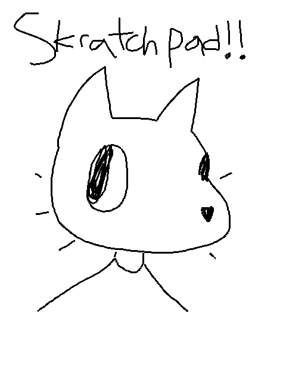

# Skratchpad
Small note-taking application written in C and Raylib.

Left click draws, Right click erases. Ctrl-S to save (in the same directory as the application), and hit Backspace to clear everything.

## Building
It's a simple as navigating to the repo directory and running make.

This program is under the zlib/libpng license.
